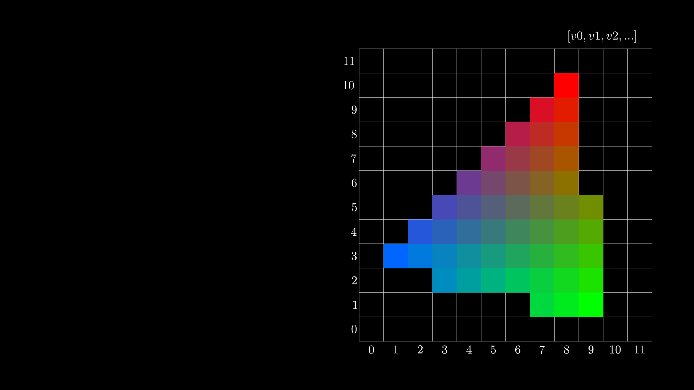
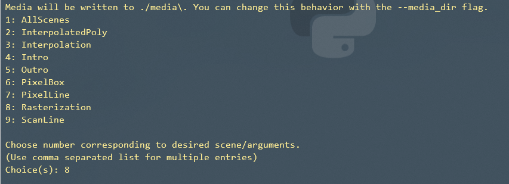

# Rasterization animation
#### A purely script based animation that explains the process of the Rasterization


Rasterization animation explains the procedure of the Rasterization.
The Animation are purely python script based and realized with the help of the Mathematical Animation Engine [Manim](https://github.com/3b1b/manim)


The creator of Manim is [3blue1brown](https://www.youtube.com/c/3blue1brown) (a well known Youtuber) 
and was a strong  inspiration for making the Rasterization animation

The video can be watch on Youtube with the voice over from Cédric Girardin

<a href="http://www.youtube.com/watch?feature=player_embedded&v=YOUR_VIDEO_ID
" target="_blank"></a>

### Installation

rasterization-animation requires [Manim](https://github.com/3b1b/manim) v0.1.7+ to play the manim animation.

drag all folders from the rasterization-animation assets folder into the assets folder of manim
```bash
├── manim
│   ├── __pycache__
│   ├── active_projects
│   ├── assets
│   ├── ...
├── SLProject
│   ├── rasterization-animation
│   │   ├── ...
│   │   ├── assets
│   │   ├── ...

```
Now you can run a low preview with:
```sh
python manim\manim.py SLProject\rasterization-animation\pixel_screen.py -pl
```
And select a scene:

(Scene 6: PixelBox and Scene 7: PixelLine **can't** be run as a Scene)


